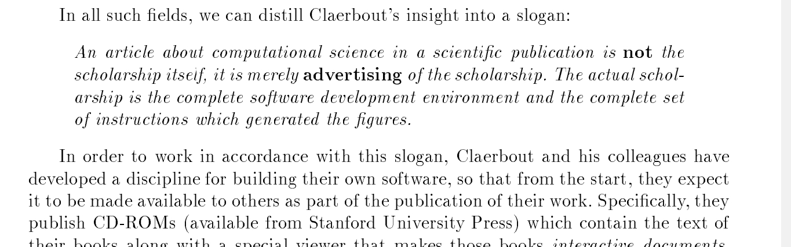
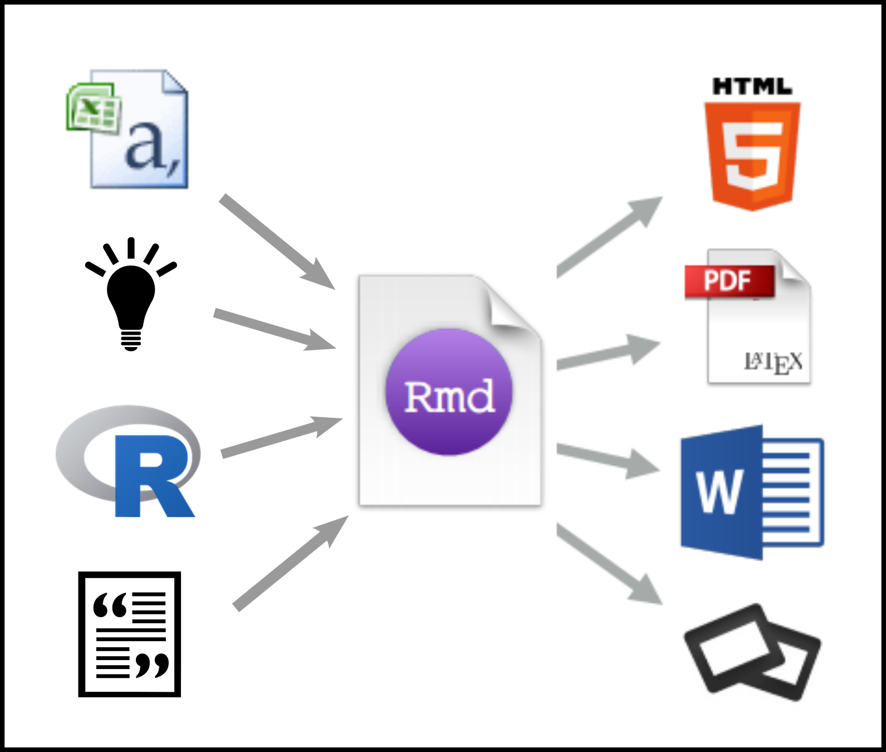
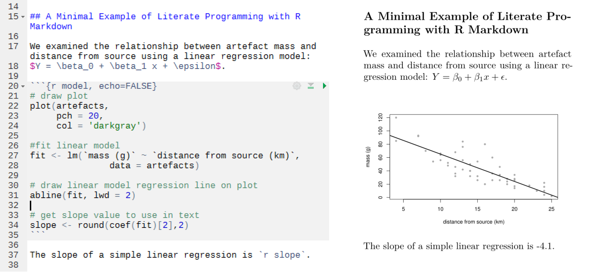
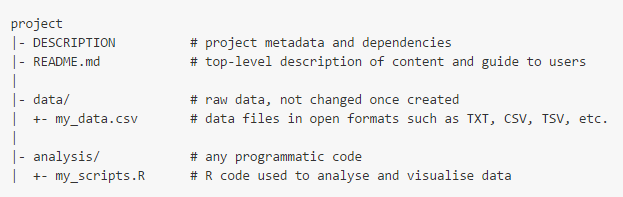

<!--- Talk based on paper at https://github.com/benmarwick/basic_computational_reproducibility_case_study -->

<HEAD><link rel="stylesheet" href="figures/font-awesome-4.6.3/css/font-awesome.min.css">

<link rel="stylesheet" href="figures/academicons-1.6.0/css/academicons.css" />

</HEAD>

```{r setup, include=FALSE}
knitr::opts_chunk$set(echo = FALSE)
```

## Overview {.bigger40}

<div><span style="font-size:1.5em; line-height:1.6em">
<i class="fa fa-question-circle  fa-1.7x"></i> Motivation    
<i class="fa fa-university   fa-1.7x"></i> Four general principles    
<i class="fa fa-briefcase  fa-1.7x"></i> Case study     
<i class="fa fa-balance-scale  fa-1.7x"></i> Costs and benefits     
</div></span>

##  {.mySegue}

<div><span style="font-size:0.7em; line-height:1.3em">
<i class="fa fa-question-circle   fa-1.7x"></i> Motivation
</div></span>

## {.bigger35}

<div class="columns-2">
   

  <i class="fa fa-flask fa-1x"></i>  Universalism   
      
  <i class="fa fa-flask fa-1x"></i>  'Communism' 
      
  <i class="fa fa-flask fa-1x"></i>  Disinterestedness 
      
  <i class="fa fa-flask fa-1x"></i>  Organized skepticism 
      

</div>


## {.flexbox .vcenter }


## Origins of scientific skepticism  {.bigger35}

<div class="columns-2">
   
   
  <i class="fa fa-male fa-1x"></i>  Robert Boyle's vacuum pump 

  <i class="fa fa-pencil fa-1x"></i>  Documentation  
      
  <i class="fa fa-eye fa-1x"></i>  'Communal witnessing' 
      
  <i class="fa fa-cloud fa-1x"></i>  Circumstances 
      
</div>

## Stodden on modern skepticism  {.bigger45}

<div class="columns-2">
   
   <!-- https://www.edge.org/annual-question/2014/response/25340 -->
   
  <i class="fa fa-wrench fa-1x"></i>  Empirical Reproducibility

  <i class="fa fa-terminal fa-1x"></i>  Computational Reproducibility  
      
  <i class="fa fa-calculator fa-1x"></i>  Statistical Reproducibility
      

</div>

## Peng: 'For every X there is a Computational X'

<div class="columns-2">
   
   <!-- http://simplystatistics.org/2013/08/21/treading-a-new-path-for-reproducible-research-part-1/ -->
   
  <i class="fa fa-desktop fa-1x"></i>  Computational Biology

  <i class="fa fa-desktop fa-1x"></i>   Computational Physics  
      
  <i class="fa fa-desktop fa-1x"></i>   Computational Chemistry
  
  <i class="fa fa-desktop fa-1x"></i>   Computational Economics
  
  <i class="fa fa-desktop fa-1x"></i>   Computational ...
      

</div>

## Documentation breakdown {.flexbox .vcenter}

   
   
<!-- http://biostatistics.oxfordjournals.org/content/11/3/385.long --> 

<!-- http://statweb.stanford.edu/~wavelab/Wavelab_850/wavelab.pdf --> 

## Computers are the new vacuum pump {.flexbox .vcenter}

   
   <!-- https://medium.com/@benmarwick/how-computers-broke-science-and-what-we-can-do-to-fix-it-5d413559ca03 -->

## {.flexbox .vcenter #myImagePage2}


<!-- http://rooseveltinstitute.org/researchers-finally-replicated-reinhart-rogoff-and-there-are-serious-problems/ -->

## {.flexbox .vcenter #myImagePage1}


<!-- http://www.economist.com/blogs/freeexchange/2013/04/debt-and-growth -->


## Key ideas {.bigger40}

<div><span style="font-size:1.1em; line-height:1.5em">
<i class="fa fa-lightbulb-o  fa-1.5x"></i> Reproducibilty is necessary for scientific progress        
<i class="fa fa-lightbulb-o  fa-1.5x"></i> Computers wrangle all the data, but also obscure it       
<i class="fa fa-lightbulb-o  fa-1.5x"></i> Especially point-and-click actions       
<i class="fa fa-lightbulb-o  fa-1.5x"></i> Technical solutions available in open source/format/data/access   
</div></span>

## {.flexbox .vcenter #myImagePage2}


<!---  https://github.com/benmarwick/basic_computational_reproducibility_case_study -->


##  {.mySegueSmall}

<div><span style="font-size:0.7em; line-height:1.3em">
<i class="fa fa-university   fa-1.7x"></i> Four general principles of reproducible research that have emerged across the sciences
</div></span>


## 1. Make openly available the data and methods that generated the published results  {.bigger30}

<font color="green">✓</font> Plain text file formats

<font color="green">✓</font> persistent URLs

Victoria Stodden's _Reproducible Research Standard_
<!-- https://web.stanford.edu/~vcs/papers/ERROLSI03092009.pdf -->

<font color="green">✓</font> Data: CC-0 (public domain)

<font color="green">✓</font> Code: MIT (no liability for reuse)

<font color="green">✓</font> Text/Figures/Media: CC-BY (attribution required)

## 2. Write scripts to do everything {.bigger35}

<font color="red">✗</font> Mouse gestures leave few traces that are enduring and accessible to others

<font color="red">✗</font> Easy to lose track of _ah hoc_ changes in mouse-driven environments 


<font color="green">✓</font> Scripts for data ingest, cleaning, analysis, visualizing, and reporting

<font color="green">✓</font> Scripts create a very high-resolution record of the research workflow in a plain text file that can be reused and inspected by others

## 3. Use version control to track changes {.bigger30}

<font color="red">✗</font> Managing different versions of computer files is very challenging

<font color="red">✗</font> Poor version control leads to loosing track of the provenance of results

<font color="green">✓</font> VCS designed for software engineering are suitable for research code and text

<font color="green">✓</font> Commit history preserves a high-resolution, transparent record of the development of a file or set of files

<font color="green">✓</font> Enables remote collaborators to
work together without overwriting each other’s work

## 4. Describe and archive the computational environment {.bigger33}

<font color="red">✗</font> Minor changes in software can cripple complex research pipelines

<font color="red">✗</font> Managing software dependencies is tedious

<font color="green">✓</font>  List of the key pieces software and their
version numbers    

<font color="green">✓</font>  Archive a self-contained computational environment like a virtual machine or Linux container

##  {.mySegueSmall}

<div><span style="font-size:0.7em; line-height:1.3em">
<i class="fa fa-briefcase   fa-1.7x"></i> Case Study
</div></span>

## {.flexbox .vcenter #myImagePage3}


## First principle  {.bigger55}

<i class="ai ai-figshare ai-1.5x"></i> All files on figshare.com

 Data in CSV format

<i class="fa fa-folder-open-o fa-1.5x"></i> Organised as an R package

## {.flexbox .vcenter #myImagePage4}


<!-- https://dx.doi.org/10.6084/m9.figshare.1297059.v2 -->

## {.flexbox .vcenter #myImagePage1}


## Second principle  {.bigger40}

 R & Rmarkdown documents
<!-- https://github.com/benmarwick/1989-excavation-report-Madjebebe -->




## {.flexbox .vcenter #myImagePage5}



## Third principle  {.bigger40}

<i class="fa fa-github fa-1.5x"></i> All files tracked with Git, hosted on GitHub
<!-- https://github.com/benmarwick/1989-excavation-report-Madjebebe -->

<i class="fa fa-user fa-1.5x"></i> Collaboration did not occur on GitHub because no co-authors used it


## {.flexbox .vcenter #myImagePage5}


## Fourth principle  {.bigger40}

 Docker image and Dockerfile to contain RStudio, packages, code and external dependencies 
<!-- https://hub.docker.com/r/benmarwick/mjb1989excavationpaper/ -->

 Based on Rocker image and templates
<!-- https://github.com/rocker-org/rocker/wiki/Using-the-RStudio-image -->

<!-- my VM: https://drive.google.com/file/d/0B87CmPqGXTzlVFVMTmVxVDNfX3M/view?usp=sharing -->

## Smaller than a VM {.flexbox .vcenter #myImagePage7}


## Extreme isolation {.flexbox .vcenter }


## Gentleman & Temple Lang (2004)
 
"research compendium as both a container for the different elements that make up the document and its computations (i.e. text, code, data,...), and as a means for distributing, managing and updating the collection."

<!-- http://biostats.bepress.com/bioconductor/paper2/ -->



<!-- https://github.com/ropensci/rrrpkg -->


## Research compendium+

<div><span style="font-size:2em; line-height:1.5em">
<i class="fa fa-file-text-o fa-1.5x"></i> README.md    
<i class="fa fa-folder-open fa-1.5x"></i> R package    
<i class="fa fa-folder-open fa-1.5x"></i> Version control     
<i class="fa fa-file-code-o fa-1.5x"></i> Environment    
     
 
</div></span>
      

##  {.mySegue}

<div><span style="font-size:0.7em; line-height:1.3em">
<i class="fa fa-balance-scale  fa-1.7x"></i> Costs & benefits
</div></span>

## Costs  {.bigger45 .build}

<i class="fa fa-clock-o  fa-1.5x"></i> Time learning the tools 

<i class="fa fa-thumbs-up  fa-1.5x"></i> That's all 

<i class="fa fa-wrench  fa-1.5x"></i> Built-in vs Bolt-on


## Benefits {.bigger40 .build}

<i class="fa fa-graduation-cap fa-1.5x"></i> Comfort of knowing that I am right & have no secrets

<i class="fa fa-clock-o  fa-1.5x"></i> Save time by reusing my previous code

<i class="fa fa-line-chart fa-1.5x"></i> Open data confers citation advantages, but magnitude is highly variable

<i class="fa fa-users fa-1.5x"></i> Open Source community membership provides access to high-quality help

## Two implications: Training {.bigger40}


## Two implications: Incentives {.bigger40}


<!-- http://www.nature.com/news/digital-badges-motivate-scientists-to-share-data-1.19907 --> 

<!-- https://osf.io/tvyxz/ -->

## {.flexbox .vcenter #myImagePage6}


## Summary {.bigger35}

<i class="fa fa-bomb  fa-1.5x"></i>  Open methods and materials, scripted workflow, version control and environment control are generic principles suitable for most fields of research   


<i class="fa fa-bomb  fa-1.5x"></i>  The specific tools will change over time, but the principles will endure     


<i class="fa fa-bomb  fa-1.5x"></i>  For most people, the technical problems already have good solutions, the remaining challenge is cultural (eg. syllabi & peer reviews)


## Colophon

Presentation written in [R Markdown using ioslides](http://rmarkdown.rstudio.com/ioslides_presentation_format.html)

Compiled into HTML5 using [RStudio](http://www.rstudio.com/ide/) & [knitr](http://yihui.name/knitr)

Source code hosting:
https://github.com/benmarwick/UOW-NIASRA-2016-talk

ORCID: http://orcid.org/0000-0001-7879-4531

Licensing: 

* Presentation: [CC-BY-3.0](http://creativecommons.org/licenses/by/3.0/us/)

* Source code: [MIT](http://opensource.org/licenses/MIT) 

